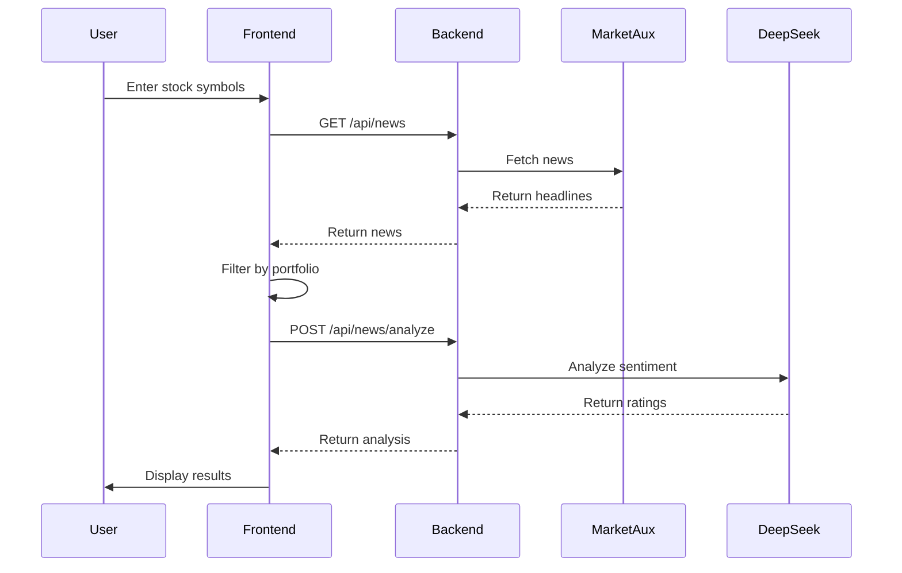

# 📈 StockPulse

> **AI-Powered Stock Sentiment Analyzer**

StockPulse is a full-stack web application that fetches real-time stock market news and leverages AI (DeepSeek/GPT) to analyze sentiment, providing actionable insights for your portfolio.


---

## ✨ Features

- 🔍 **Real-time News Fetching** - Pulls latest Indian stock market news via MarketAux API
- 🤖 **AI Sentiment Analysis** - Uses DeepSeek LLM to rate news as Positive/Neutral/Negative
- 📊 **Portfolio Filtering** - Filter news relevant to your specific stock holdings
- 📈 **Confidence Scoring** - Each analysis includes a 0-100% confidence rating
- 🎨 **Color-coded Results** - Visual sentiment indicators (green/gray/red)

---

## 🏗️ Architecture

```
StockPulse/
├── backend/                 # Express.js API Server (Port 4000)
│   ├── server.js           # Main entry point
│   ├── routes/
│   │   ├── news.js         # GET /api/news, POST /api/news/analyze
│   │   └── portfolio.js    # GET/POST /api/portfolio
│   └── services/
│       ├── newsScraper.js  # MarketAux API integration
│       └── gptAnalyzer.js  # DeepSeek AI integration
│
└── frontend/               # Next.js React App (Port 3000)
    ├── pages/
    │   ├── index.jsx       # Main dashboard
    │   └── api/            # Next.js API routes (proxy)
    ├── components/
    │   ├── PortfolioForm   # Stock symbol input
    │   ├── NewsList        # All news headlines
    │   ├── FilteredNews    # Portfolio-relevant news
    │   └── AnalysisCard    # AI sentiment cards
    └── styles/             # CSS Modules
```

---

## 🚀 Getting Started

### Prerequisites

- Node.js 18+ 
- npm or yarn
- API Keys (see below)

### API Keys Required

| Service | Purpose | Get Key |
|---------|---------|---------|
| **MarketAux** | Stock news data | [marketaux.com](https://www.marketaux.com/) |
| **DeepSeek** | AI sentiment analysis | [deepseek.com](https://platform.deepseek.com/) |

### Installation

1. **Clone the repository**
   ```bash
   git clone https://github.com/Codeguruu03/StockPulse.git
   cd StockPulse
   ```

2. **Setup Backend**
   ```bash
   cd backend
   npm install
   ```
   
   Create `.env` file in `backend/`:
   ```env
   DEEPSEEK_API_KEY=your_deepseek_api_key
   MARKETAUX_API_TOKEN=your_marketaux_api_token
   ```

3. **Setup Frontend**
   ```bash
   cd ../frontend
   npm install
   ```

4. **Run the Application**
   
   Terminal 1 (Backend):
   ```bash
   cd backend
   node server.js
   ```
   
   Terminal 2 (Frontend):
   ```bash
   cd frontend
   npm run dev
   ```

5. **Open in Browser**
   
   Visit [http://localhost:3000](http://localhost:3000)

---

## 📖 Usage

1. **Enter Stock Symbols** - Type comma-separated stock symbols (e.g., `RELIANCE, TCS, INFY`)
2. **Click Analyze** - The app filters news matching your portfolio
3. **View AI Analysis** - Each headline gets a sentiment rating with reasoning

### Example Output

```json
{
  "title": "Reliance Industries reports record quarterly profit",
  "rating": "Positive",
  "reason": "Record profits indicate strong business performance and growth",
  "confidence": 92
}
```

---

## 🔄 Data Flow



---

## 🛠️ Tech Stack

| Layer | Technology |
|-------|------------|
| **Frontend** | Next.js 15, React 19, Axios |
| **Backend** | Express.js 5, Node.js |
| **AI/ML** | DeepSeek API (OpenAI-compatible) |
| **News API** | MarketAux (Indian stocks) |
| **Styling** | CSS Modules |

---

## 📁 API Endpoints

### Backend API

| Method | Endpoint | Description |
|--------|----------|-------------|
| `GET` | `/api/news` | Fetch all stock news headlines |
| `POST` | `/api/news/analyze` | Analyze headlines with AI |
| `GET` | `/api/portfolio` | Get current portfolio |
| `POST` | `/api/portfolio` | Update portfolio symbols |

### Request/Response Examples

**POST /api/news/analyze**
```json
// Request
{
  "filtered": [
    { "title": "TCS wins $500M deal", "url": "..." }
  ]
}

// Response
{
  "analysis": [
    {
      "title": "TCS wins $500M deal",
      "rating": "Positive",
      "reason": "Large contract wins indicate strong business growth",
      "confidence": 88
    }
  ]
}
```

---

## 🔮 Future Enhancements

- [ ] User authentication & saved portfolios
- [ ] Historical sentiment tracking
- [ ] Real-time stock price integration
- [ ] Multiple market support (US, EU, Asia)
- [ ] Email/SMS alerts for significant news
- [ ] Dark mode UI

---

## 🤝 Contributing

Contributions are welcome! Please feel free to submit a Pull Request.

1. Fork the repository
2. Create your feature branch (`git checkout -b feature/AmazingFeature`)
3. Commit your changes (`git commit -m 'Add some AmazingFeature'`)
4. Push to the branch (`git push origin feature/AmazingFeature`)
5. Open a Pull Request

---

## 📄 License

This project is open source and available under the [MIT License](LICENSE).

---

## 👨‍💻 Author

**Naman** - [GitHub](https://github.com/Codeguruu03)

---

<p align="center">
  Made with ❤️ and ☕
</p>
